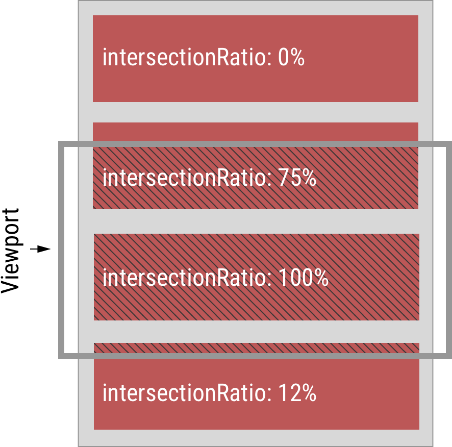

[IntersectionObserver](https://developers.google.com/web/updates/2016/04/intersectionobserver)

```javascript
let io = new IntersectionObserver(callback, option)
io.observe(element);  // 开始观察
  io.unobserve(element);  // 停止观察
  io.disconnect();  // 关闭观察器
```

#####. callback
触发两次，标元素刚刚进入视口，另一次是完全离开视口

```javascript
new IntersectionObserver(entries=>{
    //entries is Array
    entries.forEach(entry=>{
        //entry IntersectionObserverEntry 对象
        //...
    })
})
```

##### IntersectionObserverEntry

- boundingClientRect : 目标元素的矩形区域的信息
- intersectionRatio : 目标元素与视口（或根元素）的交叉区域的信息
- rootBounds:{width,height,left,right,bottom,top}
- target: 目标元素，DOM 对象
- time : 发生变化的时间，是一个高精度时间戳，单位为毫秒




#####. options

- threshold[Array] : 决定了什么时候触发回调函数,default:[0]
- root:根元素
- [rootMargin](https://wicg.github.io/IntersectionObserver/#dom-intersectionobserver-rootmargin-slot):定义根元素的margin


<iframe src="http://caniuse.com/#search=IntersectionObserver" width="100%" height="500"></iframe>  

#### 应用场景

eg. 惰性加载

<script async src="//jsfiddle.net/yangjl/nh4k5Lu9/embed/result,js,html/" width="100%" height="500px"></script>

eg. 无限加载(infinite scroll)

<script async src="//jsfiddle.net/yangjl/tzeL3e2z/embed/js,html,result/" width="100%" height="500px"></script>

#### 参考资料

- [IntersectionObserver API 使用教程](http://www.ruanyifeng.com/blog/2016/11/intersectionobserver_api.html)
- [Intersection Observers Explained](https://github.com/WICG/IntersectionObserver/blob/gh-pages/explainer.md)
- [你不知道的前端新特性](https://ppt.baomitu.com/display?slide_id=84a42e3e#/17)