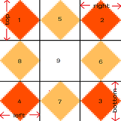

# 阅读笔记


#### [Emoji 简介](http://www.ruanyifeng.com/blog/2017/04/emoji.html)

    - Unicode 标准化，分配码点
    - 同一码点不同平台的展现不一致
    - 插件： nodejs 【[node-emoji](https://www.npmjs.com/package/node-emoji) 】，[css3](https://afeld.github.io/emoji-css/emoji.css)
    - 无法书写，只能插入文档
    - 零宽度连接符，允许多个码点组合一个Emoji
    - 查询平台:[码点查询](http://emojipedia.org/emoji/%F0%9F%98%82/)

```javascript
'😃'.codePointAt(0).toString(16) //转换为Unicode码点
String.fromCharCode('1F603') //需要使用字体
```

#### [为什么你统计 PV 的方式是错的](http://www.jianshu.com/p/84e617daf484#)

    - 用户的参与度
    - Google Analytics 开通 autotrack,[autotrack开通案例](https://github.com/philipwalton/analyticsjs-boilerplate)


#### [CSS揭秘整理之半透明边框](http://www.jianshu.com/p/d5b16170526c)

    - [background-clip](https://developer.mozilla.org/en-US/docs/Web/CSS/background-clip)
        - content-box
        - padding-box
        - text
        - border-box 【default】
    - [border](https://developer.mozilla.org/en-US/docs/Web/CSS/border)
    - [border-image](https://developer.mozilla.org/en-US/docs/Web/CSS/border-image)
        - border-image-source:none
        - border-image-slice:[ <number> | <percentage> ]{1,4}&& fill?
            - 像素或百分比
            -,
        - border-image-width:1 [ <length> | <percentage> | <number> | auto ]{1,4}
            - e.g. border-image-width: 5% 2em 10% auto;
        - border-image-repeat:stretch
            - stretch:拉伸
            - repeat:平铺
            - round:整数次平铺
        - border-image-outset:[ <length> | <number> ]{1,4} 将边框图片延伸到盒子外面
        - [demo案例](https://jsfiddle.net/yangjl/hovgg0cL/)


#### [用 Git 钩子进行简单自动部署](https://aotu.io/notes/2017/04/10/githooks/)

    - [自定义-Git-Git-钩子](https://git-scm.com/book/zh/v2/%E8%87%AA%E5%AE%9A%E4%B9%89-Git-Git-%E9%92%A9%E5%AD%90)

#### [GPU加速是什么](https://aotu.io/notes/2017/04/11/GPU/)
    - GPU提升性能时，需要存储。移动设备内存低，多的 GPU 加速会引起页面卡顿甚至闪退
    - 查看的方法 F12 - [more-tools] - Rendering[layerBorders] +layers【查看Memory】 - timeline[]

#### [How to Study: A Brief Guide](http://www.cse.buffalo.edu/~rapaport/howtostudy.html)
    - 学习时间安排 30+/week
    - 笔记
        - 写纸上
        - 简要重点的，使用缩写，提问题和评论
        - 扩展阅读复习
        - 整理到电脑
    - 如何学习书籍
        - 如何高效学习
        - 如何阅读一本书
        - [高效笔记法](http://www.wikihow.com/Take-Cornell-Notes)（康奈尔笔记法）
